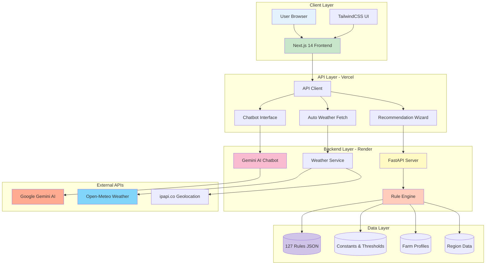
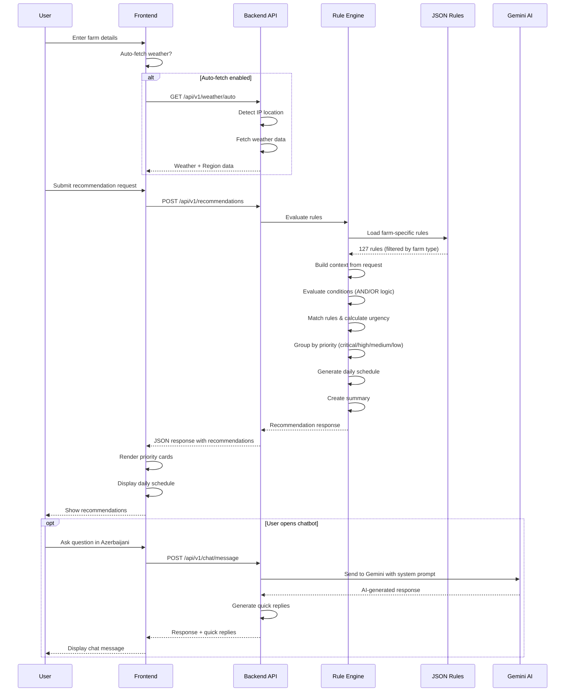
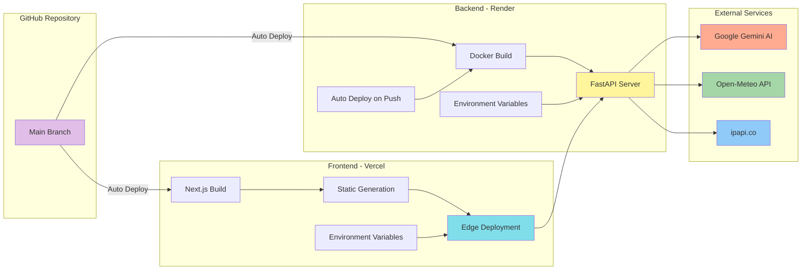
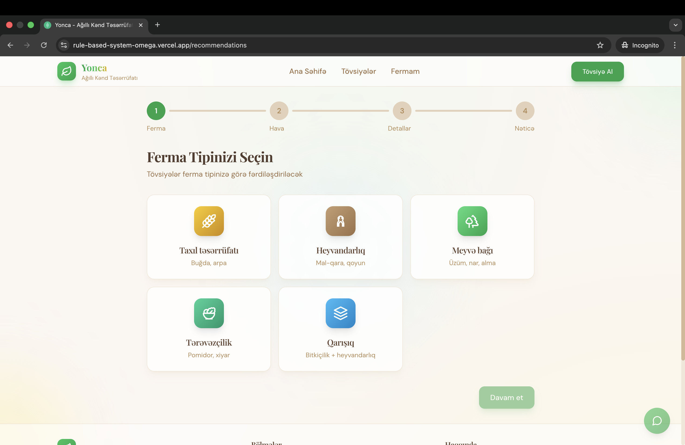
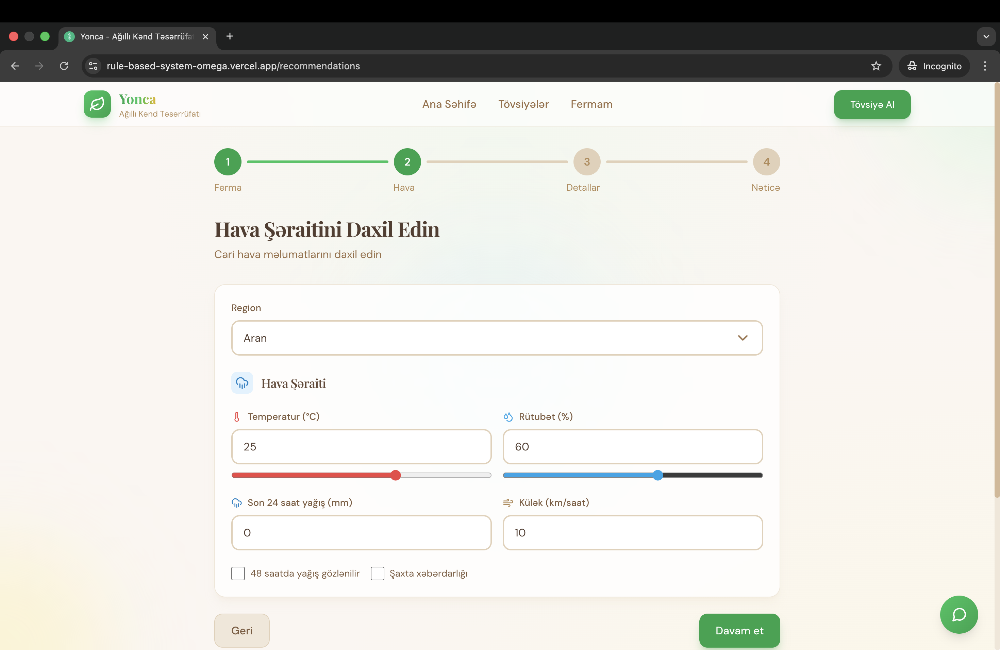
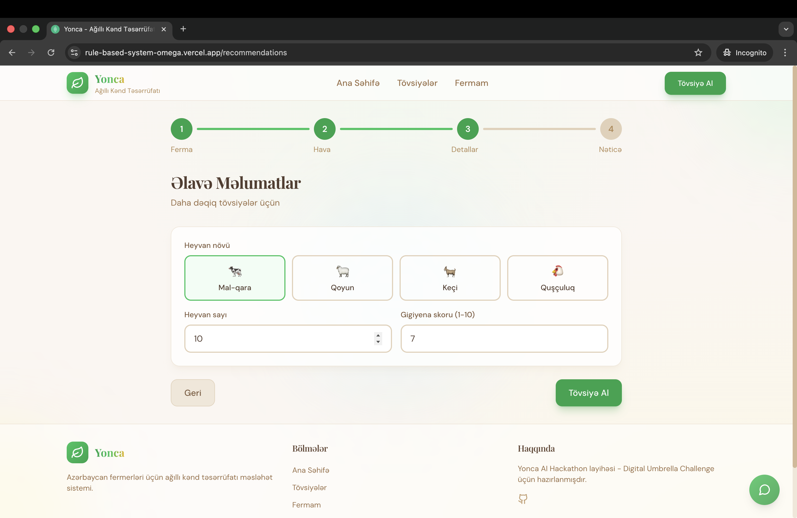
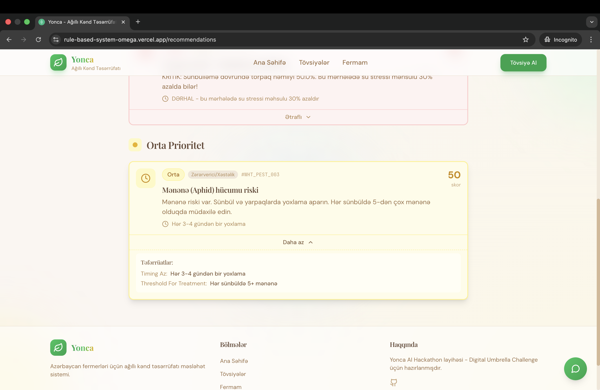
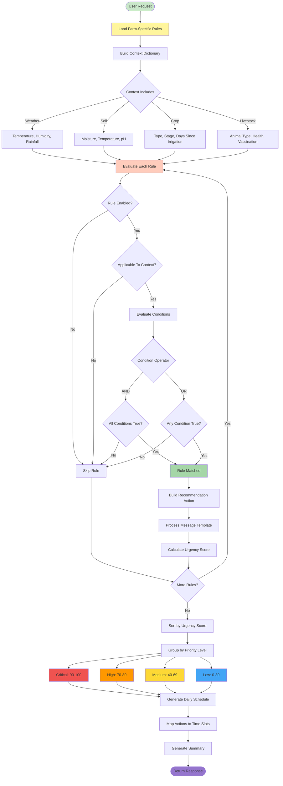

# 🌱 Yonca - Agricultural Advisory System

**Rule-Based AI Recommendation Engine for Azerbaijan Farmers**

[](https://rule-based-system.onrender.com)
[](https://rule-based-system.onrender.com/docs)
[](https://your-frontend-url.vercel.app)
[](https://www.python.org/)
[](https://fastapi.tiangolo.com/)
[](https://nextjs.org/)
[](https://www.typescriptlang.org/)
[](https://github.com)

## 📑 Table of Contents

- [🚀 Live Deployment](#-live-deployment)
- [📊 System Overview](#-system-overview)
- [🏗️ Architecture](#️-architecture)
  - [System Architecture Diagram](#system-architecture-diagram)
  - [Data Flow Diagram](#data-flow-diagram)
- [🚀 Deployment Guide](#-deployment-guide)
  - [Backend Deployment (Render)](#backend-deployment-render)
  - [Frontend Deployment (Vercel)](#frontend-deployment-vercel)
- [🔑 Environment Variables Reference](#-environment-variables-reference)
- [📡 API Reference](#-api-reference)
- [📁 Project Structure](#-project-structure)
  - [Rule Evaluation Flow](#rule-evaluation-flow)
- [🖼️ Frontend Screenshots](#️-frontend-screenshots)
- [💻 Local Development](#-local-development)
- [🧪 Testing the API](#-testing-the-api)
- [🔧 Troubleshooting](#-troubleshooting)
- [📊 Farm Types & Rules](#-farm-types--rules)
- [🌍 Supported Regions](#-supported-regions)

---

## 🚀 Live Deployment

- **Backend API**: https://rule-based-system.onrender.com
- **API Documentation**: https://rule-based-system.onrender.com/docs
- **Frontend**: Deploy on Vercel (see instructions below)

⚠️ **Important**: Backend is on Render free tier - first request may take **4-5 minutes** to wake up from sleep. Subsequent requests are instant.

---

## 📊 System Overview

```
127 Agricultural Rules | 5 Farm Types | 5 Regions | Bilingual (AZ/EN)
```

| Feature | Count |
|---------|-------|
| **Total Rules** | 127 |
| **Farm Types** | 5 (Wheat, Livestock, Orchard, Vegetable, Mixed) |
| **Regions** | 5 (Aran, Lankaran, Sheki-Zagatala, Ganja-Gazakh, Mountainous) |
| **API Endpoints** | 22 |
| **Chatbot Intents** | 20+ |
| **Languages** | Azerbaijani (primary) + English |

---

## 🏗️ Architecture

### System Architecture Diagram



### Data Flow Diagram



---

## 🚀 Deployment Guide

### Deployment Architecture



### Backend Deployment (Render)

#### Step 1: Create Render Service

1. Go to [Render Dashboard](https://dashboard.render.com/)
2. Click **New** → **Web Service**
3. Connect your GitHub repository
4. Configure:
   - **Name**: `yonca-backend` (or any name)
   - **Root Directory**: `backend`
   - **Environment**: `Docker`
   - **Region**: `Oregon` (or closest to you)
   - **Plan**: `Free`

#### Step 2: Set Environment Variables

In Render dashboard, add these environment variables:

| Key | Value | Description |
|-----|-------|-------------|
| `GEMINI_API_KEY` | `AIzaSy...` | **REQUIRED** - Get from https://aistudio.google.com/app/apikey |
| `CORS_ORIGINS` | `https://your-frontend.vercel.app` | Frontend URL (update after deploying frontend) |
| `DEBUG` | `False` | Production mode |

⚠️ **Critical**: The chatbot will NOT work without `GEMINI_API_KEY`. Get your free API key from Google AI Studio.

#### Step 3: Deploy

- Click **Create Web Service**
- Wait 5-10 minutes for build
- Your API will be at: `https://your-service-name.onrender.com`

#### Step 4: Test Backend

```bash
# Health check
curl https://your-backend-url.onrender.com/health

# Get stats
curl https://your-backend-url.onrender.com/api/v1/stats
```

---

### Frontend Deployment (Vercel)

#### Step 1: Deploy to Vercel

```bash
# Install Vercel CLI
npm i -g vercel

# Navigate to frontend
cd frontend

# Deploy
vercel --prod
```

Or use Vercel Dashboard:
1. Go to [Vercel](https://vercel.com)
2. Import your GitHub repository
3. Set **Root Directory**: `frontend`
4. Click Deploy

#### Step 2: Set Environment Variables

In Vercel dashboard → Settings → Environment Variables:

| Key | Value | Example |
|-----|-------|---------|
| `NEXT_PUBLIC_API_URL` | `https://your-backend-url.onrender.com` | `https://rule-based-system.onrender.com` |

⚠️ **Important**: Redeploy frontend after setting environment variable!

#### Step 3: Update Backend CORS

Go back to Render dashboard and update `CORS_ORIGINS`:

```
CORS_ORIGINS=https://your-app.vercel.app
```

---

## 🔑 Environment Variables Reference

### Backend (`.env`)

```bash
# REQUIRED - Google Gemini AI Chatbot
GEMINI_API_KEY=your_gemini_api_key_here

# Required for production
CORS_ORIGINS=https://your-frontend.vercel.app

# Optional
DEBUG=False  # Set to True for development
```

**Get Gemini API Key**:
1. Visit https://aistudio.google.com/app/apikey
2. Create a new API key (free tier available)
3. Copy and add to environment variables

**Where to set**:
- **Render**: Dashboard → Environment → Environment Variables
- **Local**: Create `.env` file in **project root** (not in backend/ subdirectory)

⚠️ **Important**: The backend loads `.env` from the project root, not from `backend/` directory!

---

### Frontend (`.env.local`)

```bash
# Required
NEXT_PUBLIC_API_URL=https://rule-based-system.onrender.com
```

**Where to set**:
- **Vercel**: Dashboard → Settings → Environment Variables
- **Local**: Create `frontend/.env.local` file

---

## 📡 API Reference

### Base URL

```
https://rule-based-system.onrender.com
```

### Authentication

No authentication required (public API)

### Endpoints

#### 1. Get Recommendations

**POST** `/api/v1/recommendations`

**Request Body**:
```json
{
  "farm_type": "wheat",
  "region": "aran",
  "weather": {
    "temperature": 35,
    "humidity": 80,
    "rainfall_last_24h": 0
  },
  "soil": {
    "soil_moisture": 45
  },
  "crop_context": {
    "crop_type": "wheat",
    "stage": "heading",
    "days_since_irrigation": 5,
    "days_since_fertilization": 25
  }
}
```

**Real Response** (from deployed backend):
```json
{
  "farm_type": "wheat",
  "region": "aran",
  "response_date": "2025-12-27",
  "generated_at": "2025-12-27T10:01:21.023461",
  "critical_alerts": [
    {
      "rule_id": "WHT_IRR_001",
      "name_az": "Kritik temperatur suvarması",
      "name_en": "Critical temperature irrigation",
      "category": "irrigation",
      "urgency": "critical",
      "urgency_score": 100,
      "message_az": "TƏCİLİ: Temperatur 35.0°C - buğda üçün kritik həddədir. Dərhal suvarma tələb olunur.",
      "message_en": "URGENT: Temperature 35.0°C is critical for wheat. Immediate irrigation required.",
      "action_type": "irrigate",
      "timing_az": "Dərhal - səhər 05:00-07:00 və ya axşam 19:00-21:00"
    },
    {
      "rule_id": "WHT_IRR_004",
      "name_az": "Torpaq nəmliyi - Sünbülləmə (KRİTİK)",
      "name_en": "Soil moisture - Heading (CRITICAL)",
      "category": "irrigation",
      "urgency": "critical",
      "urgency_score": 95,
      "message_az": "KRİTİK: Sünbülləmə dövründə torpaq nəmliyi 45.0%. Bu mərhələdə su stressi məhsulu 30% azalda bilər!",
      "message_en": "CRITICAL: Soil moisture 45.0% during heading. Water stress at this stage can reduce yield by 30%!",
      "action_type": "irrigate",
      "timing_az": "DƏRHAL - bu mərhələdə su stressi məhsulu 30% azaldır"
    }
  ],
  "high_priority": [
    {
      "rule_id": "WHT_IRR_009",
      "name_az": "Suvarma intervalı aşımı - Sünbülləmə",
      "name_en": "Irrigation interval exceeded - Heading",
      "category": "irrigation",
      "urgency": "high",
      "urgency_score": 75,
      "message_az": "Son suvarmadan 5 gün keçib. Sünbülləmə kritik dövrdür - hər 4 gündən bir suvarma vacibdir.",
      "message_en": "5 days since last irrigation. Heading is critical - every 4 days essential.",
      "action_type": "irrigate",
      "timing_az": "Bu gün"
    }
  ],
  "medium_priority": [],
  "low_priority": [],
  "info": [],
  "daily_schedule": [
    {
      "time_slot": "05:00-07:00",
      "task_az": "Kritik temperatur suvarması",
      "task_en": "Critical temperature irrigation",
      "priority": "must_do",
      "related_rule_id": "WHT_IRR_001",
      "urgency_score": 100
    },
    {
      "time_slot": "05:00-07:00",
      "task_az": "Torpaq nəmliyi - Sünbülləmə (KRİTİK)",
      "task_en": "Soil moisture - Heading (CRITICAL)",
      "priority": "must_do",
      "related_rule_id": "WHT_IRR_004",
      "urgency_score": 95
    },
    {
      "time_slot": "05:00-07:00",
      "task_az": "Suvarma intervalı aşımı - Sünbülləmə",
      "task_en": "Irrigation interval exceeded - Heading",
      "priority": "must_do",
      "related_rule_id": "WHT_IRR_009",
      "urgency_score": 75
    }
  ],
  "total_recommendations": 3,
  "summary_az": "⚠️ DİQQƏT: 2 kritik xəbərdarlıq var! Dərhal müdaxilə lazımdır. Ümumi 3 tövsiyə.",
  "summary_en": "⚠️ ATTENTION: 2 critical alerts! Immediate action required. Total 3 recommendations."
}
```

---

#### 2. Get System Statistics

**GET** `/api/v1/stats`

**Real Response**:
```json
{
  "total_rules": 127,
  "rules_by_farm_type": {
    "wheat": 31,
    "livestock": 22,
    "orchard": 26,
    "vegetable": 31,
    "mixed": 17
  },
  "farm_types_count": 5,
  "regions_count": 5,
  "rule_categories": {
    "wheat": ["irrigation", "fertilization", "pest_disease", "harvest"],
    "livestock": ["disease_risk", "feeding", "veterinary"],
    "orchard": ["irrigation", "fertilization", "pruning", "pest_disease"],
    "vegetable": ["irrigation", "fertilization", "greenhouse", "pest_disease"],
    "mixed": ["integration", "resource_allocation", "daily_coordination"]
  }
}
```

---

#### 3. Get Farm Types

**GET** `/api/v1/farms`

**Real Response**:
```json
{
  "farm_types": [
    {
      "id": "wheat",
      "name_az": "Taxıl təsərrüfatı",
      "name_en": "Wheat/Cereals Farm",
      "description_az": "Buğda, arpa və digər dənli bitkilər"
    },
    {
      "id": "livestock",
      "name_az": "Heyvandarlıq",
      "name_en": "Livestock Farm",
      "description_az": "Mal-qara, qoyun, keçi, quşçuluq"
    },
    {
      "id": "orchard",
      "name_az": "Meyvə bağı",
      "name_en": "Orchard",
      "description_az": "Alma, üzüm, nar, əncir və digər meyvələr"
    },
    {
      "id": "vegetable",
      "name_az": "Tərəvəzçilik",
      "name_en": "Vegetable Farm",
      "description_az": "Pomidor, xiyar, kartof və digər tərəvəzlər"
    },
    {
      "id": "mixed",
      "name_az": "Qarışıq təsərrüfat",
      "name_en": "Mixed Farm",
      "description_az": "Bitkiçilik və heyvandarlıq birlikdə"
    }
  ]
}
```

---

#### 4. Health Check

**GET** `/health`

**Real Response**:
```json
{
  "status": "healthy",
  "rules_loaded": true,
  "constants_loaded": true,
  "profiles_loaded": true
}
```

---

####5. Auto-Fetch Weather (IP-Based)

**GET** `/api/v1/weather/auto`

**Purpose**: Automatically detect user location and fetch real-time weather to reduce manual input.

**Real Response**:
```json
{
  "temperature": 8,
  "humidity": 63,
  "rainfall_last_24h": 0,
  "wind_speed": 26,
  "frost_warning": false,
  "location": {
    "city": "Baku",
    "country": "Azerbaijan",
    "region": "Baku City",
    "latitude": 40.4093,
    "longitude": 49.8671
  },
  "region": "aran"
}
```

**Architecture** (Backend-First for Security):
```
User → Frontend → Backend → IP API (ipapi.co) → Weather API (open-meteo.com)
```

**Why Backend-First?**
- ✅ No API keys exposed to users
- ✅ Rate limiting control
- ✅ Caching capability
- ✅ Graceful fallback to manual input

**APIs Used** (100% Free, No Auth):
- **IP Geolocation**: https://ipapi.co
- **Weather Data**: https://open-meteo.com

---

#### 6. Other Endpoints

| Method | Endpoint | Description |
|--------|----------|-------------|
| GET | `/api/v1/farms/{farm_type}/profile` | Get farm profile details |
| GET | `/api/v1/rules` | List all rules |
| GET | `/api/v1/rules/search?q=keyword` | Search rules |
| GET | `/api/v1/constants` | Get thresholds, regions, stages |
| POST | `/api/v1/chat/message` | Chatbot interaction |
| GET | `/api/v1/chat/intents` | Available chatbot intents |

**Full API Documentation**: https://rule-based-system.onrender.com/docs

---

## ⏰ Render Free Tier Wake-Up Time

⚠️ **Important**: The backend is deployed on Render's free tier, which has the following behavior:

### Cold Start Issue

- **Sleep After Inactivity**: Backend goes to sleep after 15 minutes of no requests
- **Wake-Up Time**: First request after sleep takes **4-5 minutes** to respond
- **Subsequent Requests**: Instant response after wake-up

### How to Handle in Frontend

The frontend automatically handles this with loading states. Users will see:

```
"Yüklənir..." (Loading...)
```

on the first request. This is normal and expected.

### Keep Backend Awake (Optional)

For production, consider:
1. Upgrading to Render paid plan ($7/month) - no sleep
2. Using a cron job to ping `/health` every 10 minutes
3. Deploying to another platform (Railway, Fly.io)

---

## 🖼️ Frontend Screenshots

### 1. Landing Page

*Hero section with farm type cards and features overview*

### 2. Recommendation Wizard - Step 1

*Interactive farm type selection with descriptions*

### 3. Recommendation Wizard - Step 2

*Weather and soil data input form*

### 4. Recommendation Wizard - Step 3

*Crop type, growth stage, and farming details*

### 5. Results - Critical Alerts

*Priority-based recommendations with actionable insights*

### 6. Results - Daily Schedule

*Time-slotted daily task schedule*

### 7. Chatbot Interface

*Intelligent chatbot with quick replies and intent recognition*

---

## 💻 Local Development

### Prerequisites

- **Backend**: Python 3.10+
- **Frontend**: Node.js 20+, npm 9+

### Backend Setup

```bash
# 1. Set up environment variables
cd rule_based_recommendation_system  # Project root
cp .env.example .env
# Edit .env and add your GEMINI_API_KEY

# 2. Install dependencies
cd backend
python3 -m venv venv
source venv/bin/activate  # On Windows: venv\Scripts\activate
pip install -r requirements.txt

# 3. Run server
python3 -m uvicorn app.main:app --reload --port 8000
```

Backend will be at: http://localhost:8000

⚠️ **Important**: Create `.env` in **project root**, not in `backend/` directory!

### Frontend Setup

```bash
cd frontend

# Install dependencies
npm install

# Create .env.local
echo "NEXT_PUBLIC_API_URL=http://localhost:8000" > .env.local

# Run development server
npm run dev
```

Frontend will be at: http://localhost:3000

---

## 🧪 Testing the API

### Using cURL

```bash
# Health check
curl https://rule-based-system.onrender.com/health

# Get recommendations
curl -X POST https://rule-based-system.onrender.com/api/v1/recommendations \
  -H "Content-Type: application/json" \
  -d '{
    "farm_type": "wheat",
    "region": "aran",
    "weather": {"temperature": 35, "humidity": 80, "rainfall_last_24h": 0},
    "soil": {"soil_moisture": 45},
    "crop_context": {
      "crop_type": "wheat",
      "stage": "heading",
      "days_since_irrigation": 5,
      "days_since_fertilization": 25
    }
  }'
```

### Using Python

```python
import requests

url = "https://rule-based-system.onrender.com/api/v1/recommendations"
payload = {
    "farm_type": "wheat",
    "region": "aran",
    "weather": {
        "temperature": 35,
        "humidity": 80,
        "rainfall_last_24h": 0
    },
    "soil": {"soil_moisture": 45},
    "crop_context": {
        "crop_type": "wheat",
        "stage": "heading",
        "days_since_irrigation": 5,
        "days_since_fertilization": 25
    }
}

response = requests.post(url, json=payload)
print(response.json())
```

---

## 📁 Project Structure

```
rule_based_system/
├── backend/
│   ├── app/
│   │   ├── api/              # API endpoints
│   │   ├── chatbot/          # Chatbot engine
│   │   ├── core/             # Configuration
│   │   ├── data/             # 127 rules + constants
│   │   ├── models/           # Pydantic schemas
│   │   ├── services/         # Rule engine
│   │   └── main.py
│   ├── Dockerfile
│   ├── requirements.txt
│   └── .env.example
│
├── frontend/
│   ├── app/                  # Next.js pages
│   ├── components/           # React components
│   ├── lib/                  # API client
│   ├── Dockerfile
│   ├── package.json
│   └── .env.example
│
└── docs/
    └── screenshots/          # UI screenshots
```

### Rule Evaluation Flow



---

## 🔧 Troubleshooting

### Frontend can't reach backend

**Error**: `Xəta baş verdi. Backend API ilə əlaqə yoxdur.`

**Solution**:
1. Check `NEXT_PUBLIC_API_URL` is set correctly in Vercel
2. Verify backend is awake (visit `/health` endpoint)
3. Check browser console for CORS errors
4. Update `CORS_ORIGINS` in backend Render settings

### No recommendations returned

**Error**: `Hər şey qaydasındadır! Hazırda heç bir xüsusi tövsiyə yoxdur.`

**Solution**:
- Make sure you selected **crop type** and **growth stage** in Step 3
- Check that weather and soil values are realistic
- View browser console for request/response logs

### Backend takes too long

**Issue**: First request takes 4-5 minutes

**This is normal** - Render free tier sleeps after inactivity. Solution:
- Wait for first request to complete
- Upgrade to paid plan ($7/month)
- Use cron job to keep alive

---

## 📊 Farm Types & Rules

| Farm Type | Rules | Categories |
|-----------|-------|------------|
| **Wheat** | 31 | Irrigation (11), Fertilization (6), Pest/Disease (7), Harvest (7) |
| **Livestock** | 22 | Disease Risk (7), Feeding (7), Veterinary (8) |
| **Orchard** | 26 | Irrigation (7), Fertilization (6), Pruning (6), Pest/Disease (7) |
| **Vegetable** | 31 | Irrigation (8), Fertilization (7), Greenhouse (8), Pest/Disease (8) |
| **Mixed** | 17 | Integration (5), Resource Allocation (5), Daily Coordination (7) |

---

## 🌍 Supported Regions

- **Aran** - Semi-arid, hot and dry, irrigation-dependent
- **Lankaran** - Subtropical, humid, high rainfall
- **Sheki-Zagatala** - Temperate, fruit orchards
- **Ganja-Gazakh** - Dry continental, wheat and grapes
- **Mountainous** - Alpine, cold, short growing season

---

## 📄 License

This project was developed for the Yonca AI Hackathon - Digital Umbrella Challenge.

---

## 👥 Contributors

- **Backend**: FastAPI + Python
- **Frontend**: Next.js + TypeScript
- **Deployment**: Render (Backend) + Vercel (Frontend)

---

## 📞 Support

- **API Documentation**: https://rule-based-system.onrender.com/docs
- **Issues**: GitHub Issues
- **Backend Health**: https://rule-based-system.onrender.com/health

---

**Built with ❤️ for Azerbaijan farmers**
