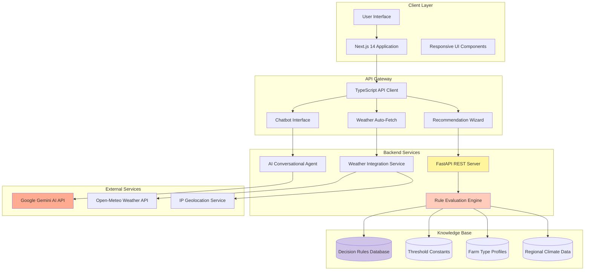
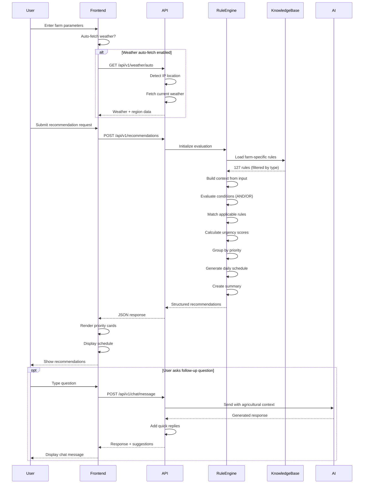
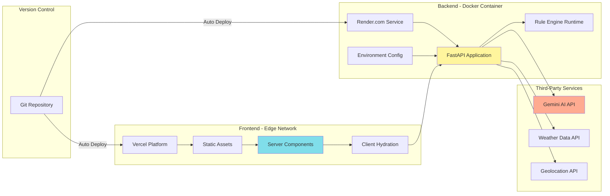
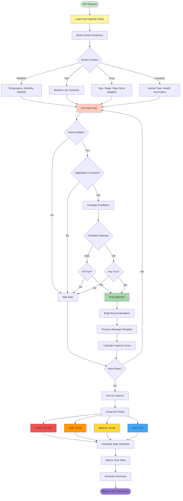

# Agricultural Advisory System

**Rule-Based Decision Support Platform for Modern Farming Operations**

[](https://rule-based-system.onrender.com)
[](https://rule-based-system.onrender.com/docs)
[](https://www.python.org/)
[](https://fastapi.tiangolo.com/)
[](https://nextjs.org/)
[](https://www.typescriptlang.org/)
[](LICENSE)

## 📑 Table of Contents

- [Overview](#overview)
- [Problem Domain](#problem-domain)
- [System Capabilities](#system-capabilities)
- [Architecture](#architecture)
- [Deployment Guide](#deployment-guide)
- [API Reference](#api-reference)
- [Project Structure](#project-structure)
- [Local Development](#local-development)
- [Configuration](#configuration)

---

## Overview

This platform provides intelligent, data-driven agricultural recommendations through a sophisticated rule-based expert system. Designed for farming operations requiring actionable guidance on irrigation, fertilization, pest management, and resource optimization, the system evaluates real-time environmental conditions against a comprehensive knowledge base of agricultural best practices.

### System Statistics

```
127 Decision Rules | 5 Farm Types | 5 Climate Zones | Bilingual Support
```

| Metric | Value |
|--------|-------|
| **Decision Rules** | 127 domain-specific rules |
| **Farm Types Supported** | Cereals, Livestock, Orchards, Vegetables, Mixed Operations |
| **Climate Zones** | 5 distinct agricultural regions |
| **API Endpoints** | 22 REST endpoints |
| **AI Capabilities** | Conversational assistant with 20+ agricultural intents |
| **Language Support** | Azerbaijani (primary) + English |

---

## Problem Domain

### Agricultural Challenge

Modern farming requires timely, precise decision-making across multiple variables:
- Environmental conditions (temperature, humidity, rainfall)
- Soil characteristics (moisture, pH, nutrients)
- Crop/livestock growth stages and health indicators
- Resource availability and allocation priorities
- Regional climate patterns and seasonal variations

**Gap**: Farmers often lack access to real-time, contextual advisory services that synthesize complex agricultural knowledge into actionable daily recommendations.

### Solution Approach

This system addresses the advisory gap through:

1. **Expert Knowledge Codification**: 127 agricultural rules capturing domain expertise across crop science, livestock management, and integrated farming practices
2. **Real-Time Decision Engine**: Context-aware evaluation of current conditions against best practices
3. **Priority-Based Recommendations**: Urgency scoring (0-100) to triage critical vs. routine actions
4. **Multi-Farm Support**: Specialized rule sets for wheat/cereals (31 rules), livestock (22 rules), orchards (26 rules), vegetables (31 rules), and mixed operations (17 rules)
5. **Bilingual Accessibility**: Native Azerbaijani support with English translation for broader reach

---

## System Capabilities

### Core Features

#### 1. Rule-Based Recommendation Engine
- **127 Decision Rules** organized by farm type and operational category
- **Condition Evaluation**: Supports complex AND/OR logic with nested conditions
- **Urgency Scoring**: 0-100 scale for prioritization (Critical: 90-100, High: 70-89, Medium: 40-69, Low: 0-39)
- **Daily Scheduling**: Generates time-slotted task schedules based on optimal agricultural practices
- **Multi-Language**: Azerbaijani and English message templating

#### 2. Environmental Integration
- **Auto-Location Detection**: IP-based geolocation for frictionless onboarding
- **Weather Data Retrieval**: Real-time temperature, humidity, rainfall, wind speed
- **Regional Mapping**: Automatically maps user location to relevant climate zone
- **Frost Warnings**: Temperature-based alerts for sensitive crops

#### 3. AI-Powered Assistance
- **Conversational Interface**: Google Gemini-powered chatbot for natural language queries
- **Session Management**: Context-aware conversations with history tracking
- **Smart Suggestions**: Keyword-based quick replies for common follow-up questions
- **Agricultural Expertise**: Trained on farming terminology and practical advice

#### 4. Farm Type Coverage

| Farm Type | Rule Categories | Example Use Cases |
|-----------|----------------|-------------------|
| **Wheat/Cereals** | Irrigation (11), Fertilization (6), Pest/Disease (7), Harvest (7) | Optimal irrigation timing during heading stage, nitrogen deficiency detection |
| **Livestock** | Disease Risk (7), Feeding (7), Veterinary (8) | Heat stress monitoring, vaccination schedules, feed optimization |
| **Orchards** | Irrigation (7), Fertilization (6), Pruning (6), Pest/Disease (7) | Tree age-specific pruning, fruit-specific pest management |
| **Vegetables** | Irrigation (8), Fertilization (7), Greenhouse (8), Pest/Disease (8) | Greenhouse climate control, hydration monitoring, disease prevention |
| **Mixed Operations** | Integration (5), Resource Allocation (5), Daily Coordination (7) | Cross-operation resource sharing, integrated pest management |

#### 5. Regional Climate Adaptation

The system supports five distinct agricultural climate zones:

- **Semi-Arid** - Hot, dry climate requiring intensive irrigation management
- **Subtropical** - High humidity with disease pressure and pest challenges
- **Temperate Mountain** - Moderate climate ideal for fruit orchards
- **Continental Dry** - Low rainfall zones requiring water conservation strategies
- **Alpine** - High-altitude, short growing season with frost risk

---

## Architecture

### System Design



### Data Flow: Recommendation Generation



### Technology Stack

**Backend** (Python/FastAPI):
- FastAPI 0.109.0 - High-performance async REST API framework
- Pydantic 2.5.3 - Data validation and settings management
- httpx 0.26.0 - Async HTTP client for external services
- google-generativeai - Gemini AI integration
- Uvicorn 0.27.0 - ASGI server
- gunicorn 21.2.0 - Production WSGI server

**Frontend** (TypeScript/Next.js):
- Next.js 14.2.18 - React framework with App Router
- TypeScript 5 - Type-safe JavaScript
- TailwindCSS 3.3.0 - Utility-first CSS framework
- Lucide React 0.263.1 - Icon library
- Framer Motion 10.16.16 - Animation library
- React Markdown 10.1.0 - Markdown rendering

**External APIs**:
- Google Generative AI (Gemini Flash) - Conversational intelligence
- Open-Meteo API - Weather data (free, no authentication)
- ipapi.co - IP geolocation (free tier)

---

## Deployment Guide

### Production Architecture



### Backend Deployment (Render)

#### Step 1: Create Web Service

1. Navigate to [Render Dashboard](https://dashboard.render.com/)
2. **New** → **Web Service**
3. Connect your Git repository
4. Configuration:
   - **Name**: `agricultural-advisory-api` (or your choice)
   - **Root Directory**: `backend`
   - **Environment**: Docker
   - **Region**: Select closest to your users
   - **Plan**: Free tier (for testing) or Starter ($7/month for production)

#### Step 2: Configure Environment Variables

| Variable | Value | Required | Description |
|----------|-------|----------|-------------|
| `GEMINI_API_KEY` | `AIzaSy...` | **Yes** | Google Gemini API key from [AI Studio](https://aistudio.google.com/app/apikey) |
| `CORS_ORIGINS` | `https://your-frontend.vercel.app` | **Yes** | Allowed frontend origins (comma-separated) |
| `DEBUG` | `False` | No | Production mode (default: False) |

**Critical**: The chatbot will not function without `GEMINI_API_KEY`. Obtain a free API key from Google AI Studio.

#### Step 3: Deploy

- Click **Create Web Service**
- Build time: 5-10 minutes (first deployment)
- Your API URL: `https://your-service-name.onrender.com`

#### Step 4: Verify Deployment

```bash
# Health check
curl https://your-api-url.onrender.com/health

# System statistics
curl https://your-api-url.onrender.com/api/v1/stats

# API documentation
# Visit: https://your-api-url.onrender.com/docs
```

---

### Frontend Deployment (Vercel)

#### Option A: Vercel CLI

```bash
# Install Vercel CLI
npm install -g vercel

# Navigate to frontend directory
cd frontend

# Deploy to production
vercel --prod
```

#### Option B: Vercel Dashboard

1. Go to [Vercel](https://vercel.com)
2. **Import Project** → Select your Git repository
3. Configuration:
   - **Framework**: Next.js (auto-detected)
   - **Root Directory**: `frontend`
   - **Build Command**: `npm run build` (default)
   - **Output Directory**: `.next` (default)
4. **Environment Variables**:
   - **Key**: `NEXT_PUBLIC_API_URL`
   - **Value**: `https://your-api-url.onrender.com`
5. **Deploy**

**Important**: Redeploy frontend after changing environment variables.

#### Post-Deployment: Update CORS

Return to Render backend dashboard and update `CORS_ORIGINS`:

```
CORS_ORIGINS=https://your-frontend-url.vercel.app
```

This allows the frontend to make cross-origin requests to the backend.

---

## API Reference

### Base URL

```
Production: https://rule-based-system.onrender.com
Local:      http://localhost:8000
```

### Authentication

No authentication required (public API).

### Endpoints Overview

| Category | Endpoints | Description |
|----------|-----------|-------------|
| **Recommendations** | `POST /api/v1/recommendations`<br>`GET /api/v1/recommendations/quick` | Generate detailed recommendations based on farm parameters |
| **Weather** | `GET /api/v1/weather/auto` | Auto-fetch weather by IP geolocation |
| **Farms** | `GET /api/v1/farms`<br>`GET /api/v1/farms/{type}/profile` | List farm types and retrieve profiles |
| **Rules** | `GET /api/v1/rules`<br>`GET /api/v1/rules/search`<br>`GET /api/v1/rules/{type}/{category}` | Browse and search decision rules |
| **Constants** | `GET /api/v1/constants`<br>`GET /api/v1/constants/thresholds`<br>`GET /api/v1/constants/regions` | Retrieve threshold values and regional data |
| **Chatbot** | `POST /api/v1/chat/message`<br>`POST /api/v1/chat/reset`<br>`GET /api/v1/chat/stats` | AI-powered conversational assistance |
| **System** | `GET /`<br>`GET /health`<br>`GET /api/v1/stats` | Service health and statistics |

### Key Endpoint Examples

#### 1. Generate Recommendations

**Request**:
```http
POST /api/v1/recommendations
Content-Type: application/json

{
  "farm_type": "wheat",
  "region": "aran",
  "weather": {
    "temperature": 35,
    "humidity": 80,
    "rainfall_last_24h": 0
  },
  "soil": {
    "soil_moisture": 45
  },
  "crop_context": {
    "crop_type": "wheat",
    "stage": "heading",
    "days_since_irrigation": 5,
    "days_since_fertilization": 25
  }
}
```

**Response**:
```json
{
  "farm_type": "wheat",
  "region": "aran",
  "response_date": "2025-01-02",
  "generated_at": "2025-01-02T10:15:30.123456",
  "critical_alerts": [
    {
      "rule_id": "WHT_IRR_001",
      "name_en": "Critical temperature irrigation",
      "category": "irrigation",
      "urgency": "critical",
      "urgency_score": 100,
      "message_en": "URGENT: Temperature 35.0°C is critical for wheat. Immediate irrigation required.",
      "action_type": "irrigate",
      "timing_en": "Immediate - morning 05:00-07:00 or evening 19:00-21:00"
    }
  ],
  "high_priority": [...],
  "medium_priority": [],
  "low_priority": [],
  "daily_schedule": [
    {
      "time_slot": "05:00-07:00",
      "task_en": "Critical temperature irrigation",
      "priority": "must_do",
      "related_rule_id": "WHT_IRR_001",
      "urgency_score": 100
    }
  ],
  "total_recommendations": 3,
  "summary_en": "⚠️ ATTENTION: 2 critical alerts! Immediate action required."
}
```

#### 2. Auto-Fetch Weather

**Request**:
```http
GET /api/v1/weather/auto
```

**Response**:
```json
{
  "temperature": 8,
  "humidity": 63,
  "rainfall_last_24h": 0,
  "wind_speed": 26,
  "frost_warning": false,
  "location": {
    "city": "Baku",
    "country": "Azerbaijan",
    "region": "Absheron",
    "latitude": 40.4093,
    "longitude": 49.8671
  },
  "region": "aran"
}
```

**Architecture Note**: Weather auto-fetch uses a backend-first approach for security:
- No API keys exposed to frontend
- Centralized rate limiting and caching
- Graceful fallback to manual input

#### 3. System Statistics

**Request**:
```http
GET /api/v1/stats
```

**Response**:
```json
{
  "total_rules": 127,
  "rules_by_farm_type": {
    "wheat": 31,
    "livestock": 22,
    "orchard": 26,
    "vegetable": 31,
    "mixed": 17
  },
  "farm_types_count": 5,
  "regions_count": 5,
  "rule_categories": {
    "wheat": ["irrigation", "fertilization", "pest_disease", "harvest"],
    "livestock": ["disease_risk", "feeding", "veterinary"],
    "orchard": ["irrigation", "fertilization", "pruning", "pest_disease"],
    "vegetable": ["irrigation", "fertilization", "greenhouse", "pest_disease"],
    "mixed": ["integration", "resource_allocation", "daily_coordination"]
  }
}
```

**Full API Documentation**: Visit `/docs` endpoint for interactive Swagger UI.

---

## Project Structure

```
agricultural-advisory-system/
├── backend/                      # Python FastAPI backend
│   ├── app/
│   │   ├── api/                 # REST API endpoints
│   │   │   └── routes.py        # 22 endpoint handlers
│   │   ├── chatbot/             # AI conversational agent
│   │   │   ├── routes.py        # Chat endpoints
│   │   │   └── gemini_engine.py # Gemini integration
│   │   ├── core/                # Configuration management
│   │   │   └── config.py        # Environment settings
│   │   ├── data/                # Knowledge base (JSON)
│   │   │   ├── constants/       # Threshold values, regions, stages
│   │   │   ├── profiles/        # Farm type profiles (5 files)
│   │   │   └── rules/           # Decision rules by farm type
│   │   │       ├── wheat/       # 31 rules (4 categories)
│   │   │       ├── livestock/   # 22 rules (3 categories)
│   │   │       ├── orchard/     # 26 rules (4 categories)
│   │   │       ├── vegetable/   # 31 rules (4 categories)
│   │   │       └── mixed/       # 17 rules (3 categories)
│   │   ├── models/              # Data models
│   │   │   └── schemas.py       # Pydantic request/response schemas
│   │   ├── services/            # Business logic
│   │   │   ├── rule_engine.py   # Core evaluation engine (418 lines)
│   │   │   ├── rule_loader.py   # JSON rule file management
│   │   │   └── weather_service.py # Weather API integration
│   │   └── main.py              # Application entry point
│   ├── Dockerfile               # Production container build
│   ├── requirements.txt         # Python dependencies
│   └── .env.example             # Environment variable template
│
├── frontend/                    # Next.js TypeScript frontend
│   ├── app/
│   │   ├── layout.tsx           # Root layout with metadata
│   │   ├── page.tsx             # Landing page
│   │   ├── globals.css          # Global styles and design system
│   │   ├── recommendations/     # Recommendation wizard
│   │   │   └── page.tsx         # 4-step recommendation flow
│   │   ├── farm/                # Farm profile management
│   │   │   └── page.tsx         # Farm settings page
│   │   └── chatbot/             # AI chat interface
│   │       └── page.tsx         # Chatbot page
│   ├── components/              # React components
│   │   ├── Header.tsx           # Navigation header
│   │   ├── Footer.tsx           # Footer links
│   │   ├── FarmTypeCard.tsx     # Farm type selector
│   │   ├── WeatherInput.tsx     # Weather input form
│   │   ├── RecommendationCard.tsx # Recommendation display
│   │   ├── DailySchedule.tsx    # Task schedule view
│   │   └── ChatWidget.tsx       # Floating chat widget
│   ├── lib/
│   │   └── api.ts               # TypeScript API client
│   ├── Dockerfile               # Production container build
│   ├── package.json             # Node.js dependencies
│   ├── tailwind.config.js       # TailwindCSS configuration
│   ├── tsconfig.json            # TypeScript configuration
│   └── .env.example             # Environment variable template
│
├── docs/
│   └── screenshots/             # UI screenshots (7 images)
│
├── .env.example                 # Root environment template
├── .gitignore                   # Git ignore patterns
└── README.md                    # This file
```

### Rule Evaluation Architecture



---

## Local Development

### Prerequisites

- **Backend**: Python 3.10+
- **Frontend**: Node.js 20+, npm 9+
- **API Key**: Google Gemini API key (free tier available)

### Backend Setup

```bash
# 1. Create environment file in project root
cd rule_based_system  # Project root directory
cp .env.example .env

# 2. Edit .env and add your Gemini API key
# GEMINI_API_KEY=your_api_key_here

# 3. Install Python dependencies
cd backend
python3 -m venv venv
source venv/bin/activate  # On Windows: venv\Scripts\activate
pip install -r requirements.txt

# 4. Start development server
python3 -m uvicorn app.main:app --reload --port 8000
```

**Backend will run at**: http://localhost:8000
**API Docs**: http://localhost:8000/docs

**Important**: The `.env` file must be in the project root directory (not in `backend/`).

### Frontend Setup

```bash
cd frontend

# Install dependencies
npm install

# Create environment file
echo "NEXT_PUBLIC_API_URL=http://localhost:8000" > .env.local

# Start development server
npm run dev
```

**Frontend will run at**: http://localhost:3000

---

## Configuration

### Environment Variables

#### Backend (`.env` in project root)

```bash
# REQUIRED - Google Gemini AI API Key
GEMINI_API_KEY=your_gemini_api_key_here

# Required for production
CORS_ORIGINS=https://your-frontend-domain.com

# Optional - Development mode
DEBUG=False  # Set to True for verbose logging
```

**Obtaining Gemini API Key**:
1. Visit [Google AI Studio](https://aistudio.google.com/app/apikey)
2. Create a new API key (free tier available)
3. Copy and add to `.env` file

#### Frontend (`.env.local` in frontend directory)

```bash
# Backend API URL
NEXT_PUBLIC_API_URL=http://localhost:8000  # Local development
# NEXT_PUBLIC_API_URL=https://your-backend.onrender.com  # Production
```

**Note**: Next.js environment variables must be prefixed with `NEXT_PUBLIC_` to be accessible in the browser.

---

## Testing

### API Testing with cURL

```bash
# Health check
curl https://rule-based-system.onrender.com/health

# Get system statistics
curl https://rule-based-system.onrender.com/api/v1/stats

# Generate recommendations
curl -X POST https://rule-based-system.onrender.com/api/v1/recommendations \
  -H "Content-Type: application/json" \
  -d '{
    "farm_type": "wheat",
    "region": "aran",
    "weather": {
      "temperature": 35,
      "humidity": 80,
      "rainfall_last_24h": 0
    },
    "soil": {
      "soil_moisture": 45
    },
    "crop_context": {
      "crop_type": "wheat",
      "stage": "heading",
      "days_since_irrigation": 5,
      "days_since_fertilization": 25
    }
  }'
```

### API Testing with Python

```python
import requests

url = "https://rule-based-system.onrender.com/api/v1/recommendations"
payload = {
    "farm_type": "wheat",
    "region": "aran",
    "weather": {
        "temperature": 35,
        "humidity": 80,
        "rainfall_last_24h": 0
    },
    "soil": {"soil_moisture": 45},
    "crop_context": {
        "crop_type": "wheat",
        "stage": "heading",
        "days_since_irrigation": 5,
        "days_since_fertilization": 25
    }
}

response = requests.post(url, json=payload)
print(response.json())
```

---

## Troubleshooting

### Common Issues

#### 1. Frontend Cannot Reach Backend

**Error**: CORS or connection errors in browser console

**Solution**:
- Verify `NEXT_PUBLIC_API_URL` is set correctly in Vercel/Netlify
- Check backend is running: visit `/health` endpoint
- Update `CORS_ORIGINS` in backend to include frontend domain
- Wait for Render free tier to wake up (4-5 minutes on first request)

#### 2. Chatbot Not Working

**Error**: "Chatbot unavailable" or empty responses

**Solution**:
- Verify `GEMINI_API_KEY` is set in backend environment
- Check API key is valid at [Google AI Studio](https://aistudio.google.com/app/apikey)
- Review backend logs for authentication errors

#### 3. No Recommendations Returned

**Error**: "No recommendations found" despite valid input

**Solution**:
- Ensure crop type and growth stage are selected
- Verify weather and soil values are realistic
- Check browser console for request/response details
- Review backend logs for rule evaluation errors

#### 4. Slow First Request (Render Free Tier)

**Issue**: First API request takes 4-5 minutes

**Explanation**: Render free tier sleeps after 15 minutes of inactivity.

**Solutions**:
- Wait for initial wake-up (normal behavior)
- Upgrade to Render Starter plan ($7/month) for instant response
- Implement keep-alive ping (cron job hitting `/health` every 10 minutes)

---

## License

This project is licensed under the MIT License. See LICENSE file for details.

---

## Support

- **API Documentation**: https://rule-based-system.onrender.com/docs
- **Health Endpoint**: https://rule-based-system.onrender.com/health
- **Issues**: Use GitHub Issues for bug reports and feature requests

---

**Built for agricultural stakeholders seeking data-driven farming decisions**
