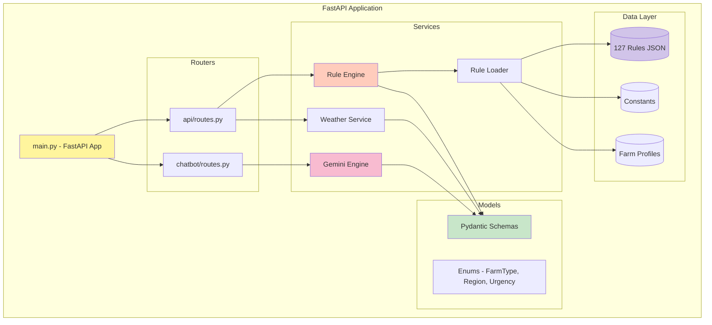
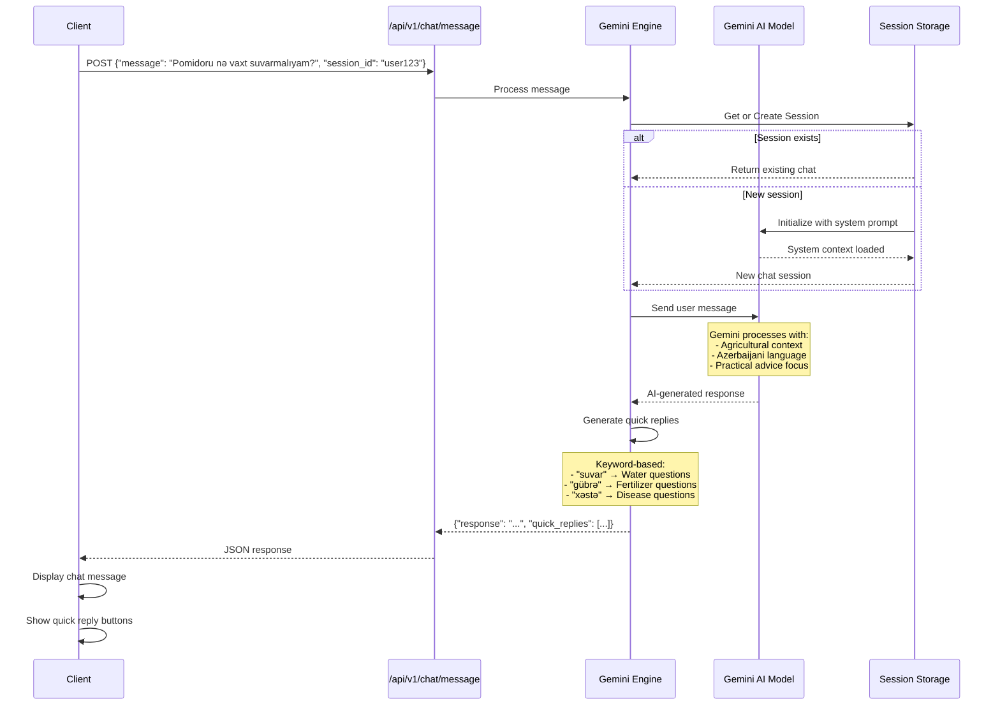
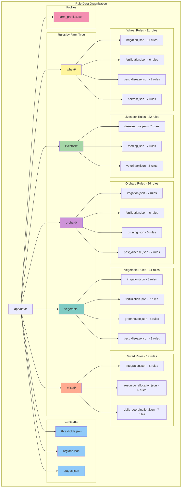

# Yonca Rule-Based Advisory API

**Azərbaycan kənd təsərrüfatı üçün qayda əsaslı məsləhət sistemi**

[](https://fastapi.tiangolo.com/)
[](https://www.python.org/)
[](https://docs.pydantic.dev/)
[](https://ai.google.dev/)

## 📑 Table of Contents

- [🚀 Quick Start](#-quick-start)
- [📖 API Documentation](#-api-documentation)
- [🏗️ Architecture Diagrams](#️-architecture-diagrams)
  - [API Structure](#api-structure)
  - [Rule Engine Processing Flow](#rule-engine-processing-flow)
  - [Chatbot Interaction Flow](#chatbot-interaction-flow)
- [🔗 Endpoints](#-endpoints)
  - [Recommendations](#recommendations)
  - [Farms & Profiles](#farms--profiles)
  - [Rules](#rules)
  - [Constants](#constants)
  - [Weather Auto-Fetch](#weather-auto-fetch)
  - [Chatbot (Gemini AI)](#chatbot-gemini-ai)
  - [System](#system)
- [📝 Example Usage](#-example-usage)
- [🏗️ Project Structure](#️-project-structure)
  - [Data Structure Organization](#data-structure-organization)
- [📊 Statistics](#-statistics)
- [🔧 Configuration](#-configuration)

---

## 🚀 Quick Start

```bash
# Install dependencies
pip install -r requirements.txt

# Run the server
uvicorn app.main:app --reload --port 8000

# Or use the run script
./run.sh
```

## 📖 API Documentation

Server işə düşdükdən sonra:
- Swagger UI: http://localhost:8000/docs
- ReDoc: http://localhost:8000/redoc

---

## 🏗️ Architecture Diagrams

### API Structure



### Rule Engine Processing Flow


### Chatbot Interaction Flow



## 🔗 Endpoints

### Recommendations

| Method | Endpoint | Description |
|--------|----------|-------------|
| POST | `/api/v1/recommendations` | Ətraflı tövsiyələr al |
| GET | `/api/v1/recommendations/quick` | Sadə parametrlərlə sürətli tövsiyə |

### Farms & Profiles

| Method | Endpoint | Description |
|--------|----------|-------------|
| GET | `/api/v1/farms` | Ferma tiplərinin siyahısı |
| GET | `/api/v1/farms/{farm_type}/profile` | Ferma profili |
| GET | `/api/v1/scenarios/{farm_type}` | Test ssenariləri |

### Rules

| Method | Endpoint | Description |
|--------|----------|-------------|
| GET | `/api/v1/rules` | Bütün qaydalar |
| GET | `/api/v1/rules/search?q=keyword` | Qayda axtarışı |
| GET | `/api/v1/rules/{farm_type}` | Ferma tipinə görə qaydalar |
| GET | `/api/v1/rules/{farm_type}/{category}` | Kateqoriyaya görə |

### Constants

| Method | Endpoint | Description |
|--------|----------|-------------|
| GET | `/api/v1/constants` | Bütün sabitlər |
| GET | `/api/v1/constants/thresholds` | Hədd dəyərləri |
| GET | `/api/v1/constants/regions` | Regionlar |
| GET | `/api/v1/constants/stages` | Mərhələlər |

### Weather Auto-Fetch

| Method | Endpoint | Description |
|--------|----------|-------------|
| GET | `/api/v1/weather/auto` | İstifadəçinin IP ünvanına əsasən avtomatik hava məlumatı |

**Architecture**: Backend-first approach
- Uses IP geolocation (ipapi.co) to detect user location
- Fetches weather data from Open-Meteo API (free, no API key needed)
- Maps location to Azerbaijan regions (aran, lankaran, sheki_zagatala, etc.)
- Returns temperature, humidity, rainfall, wind speed, and frost warnings

**Benefits**:
- ✅ No API keys exposed to frontend
- ✅ Centralized rate limiting and caching
- ✅ Graceful error handling
- ✅ Regional mapping for Azerbaijan

**Example Response**:
```json
{
  "temperature": 8,
  "humidity": 68,
  "rainfall_last_24h": 0.0,
  "wind_speed": 27,
  "frost_warning": false,
  "location": {
    "city": "Baku",
    "country": "Azerbaijan",
    "region": "Absheron",
    "latitude": 40.4093,
    "longitude": 49.8671
  },
  "region": "aran"
}
```

### Chatbot (Gemini AI)

| Method | Endpoint | Description |
|--------|----------|-------------|
| POST | `/api/v1/chat/message` | Send message to AI chatbot |
| POST | `/api/v1/chat/reset` | Reset chat session |
| GET | `/api/v1/chat/stats` | Get chatbot statistics |
| GET | `/api/v1/chat/examples` | Get example questions |

**Features**:
- ✨ **AI-Powered**: Google Gemini (gemini-flash-latest model)
- 🇦🇿 **Azerbaijani Language**: Native agricultural terminology
- 💬 **Context-Aware**: Session-based conversation history
- ⚡ **Smart Replies**: Contextual quick reply suggestions
- 📊 **Rich Formatting**: Tables, emojis, structured responses
- 🆓 **Free Tier**: No cost for usage

**Example Request**:
```json
POST /api/v1/chat/message
{
  "message": "Pomidoru nə vaxt suvarmalıyam?",
  "session_id": "user123"  // Optional
}
```

**Example Response**:
```json
{
  "response": "💧🍅 Pomidor Suvarma Vaxtı\n\nSalam! Pomidorun suvarma rejimi...",
  "quick_replies": ["💧 Nə qədər su?", "⏰ Nə vaxt suvarım?", "🌊 Hansı üsul?"]
}
```

### System

| Method | Endpoint | Description |
|--------|----------|-------------|
| GET | `/` | Root endpoint |
| GET | `/health` | Sağlamlıq yoxlaması |
| GET | `/api/v1/stats` | Statistika |

## 📝 Example Usage

### POST /api/v1/recommendations

```json
{
  "farm_type": "wheat",
  "region": "aran",
  "weather": {
    "temperature": 35,
    "humidity": 80,
    "rainfall_last_24h": 0
  },
  "soil": {
    "soil_moisture": 45
  },
  "crop_context": {
    "crop_type": "wheat",
    "stage": "heading",
    "days_since_irrigation": 5,
    "days_since_fertilization": 25
  }
}
```

### Response

```json
{
  "farm_type": "wheat",
  "region": "aran",
  "response_date": "2025-12-26",
  "critical_alerts": [...],
  "high_priority": [...],
  "medium_priority": [...],
  "daily_schedule": [...],
  "total_recommendations": 5,
  "summary_az": "⚠️ DİQQƏT: 2 kritik xəbərdarlıq var!"
}
```

### Quick Recommendation

```
GET /api/v1/recommendations/quick?farm_type=wheat&region=aran&temperature=32&humidity=85&crop_type=wheat&stage=tillering&days_since_irrigation=6&soil_moisture=48
```

## 🏗️ Project Structure

```
backend/
├── app/
│   ├── api/
│   │   └── routes.py          # API endpoints
│   ├── core/
│   │   └── config.py          # Settings
│   ├── data/
│   │   ├── constants/         # Threshold values
│   │   ├── profiles/          # Farm profiles
│   │   └── rules/             # Rule JSON files
│   ├── models/
│   │   └── schemas.py         # Pydantic models
│   ├── services/
│   │   ├── rule_engine.py     # Rule evaluation
│   │   └── rule_loader.py     # JSON loading
│   └── main.py                # FastAPI app
├── requirements.txt
└── run.sh
```

### Data Structure Organization



## 📊 Statistics

- **Total Rules**: 127
- **Farm Types**: 5 (wheat, livestock, orchard, vegetable, mixed)
- **Regions**: 5 (aran, lankaran, sheki_zagatala, ganja_gazakh, mountainous)
- **Languages**: Azerbaijani (az) + English (en)

## 🔧 Configuration

### Environment Variables

**REQUIRED**:
- `GEMINI_API_KEY`: Google Gemini AI API key for chatbot
  - Get from: https://aistudio.google.com/app/apikey
  - Free tier available
  - Chatbot will NOT work without this

**Optional**:
- `DEBUG`: Enable debug mode (default: True)
- `CORS_ORIGINS`: Allowed origins for CORS (default: http://localhost:3000)

### Setup

1. Create `.env` file in **project root** (not in backend/ directory):
```bash
cd ..  # Go to project root
cp .env.example .env
# Edit .env and add your GEMINI_API_KEY
```

2. The backend automatically loads `.env` from project root via:
```python
from pathlib import Path
from dotenv import load_dotenv

project_root = Path(__file__).parent.parent.parent
env_path = project_root / ".env"
load_dotenv(dotenv_path=env_path)
```

This allows all services (backend + frontend) to share the same `.env` file.

---

*Yonca AI Hackathon - Digital Umbrella Challenge*
