# Agricultural Advisory API

**FastAPI-Based Rule Engine for Agricultural Decision Support**

[](https://fastapi.tiangolo.com/)
[](https://www.python.org/)
[](https://docs.pydantic.dev/)
[](https://ai.google.dev/)

## 📑 Table of Contents

- [Overview](#overview)
- [Architecture](#architecture)
- [API Endpoints](#api-endpoints)
- [Rule Engine Design](#rule-engine-design)
- [Data Organization](#data-organization)
- [Quick Start](#quick-start)
- [Configuration](#configuration)
- [Testing](#testing)

---

## Overview

This backend service provides a REST API for generating agricultural recommendations through a sophisticated rule-based expert system. The platform evaluates farm-specific parameters (weather, soil, crop/livestock status) against 127 domain-specific decision rules to produce prioritized, actionable guidance.

### Key Features

- **127 Decision Rules** - Comprehensive coverage across cereals, livestock, orchards, vegetables, and mixed operations
- **Context-Aware Evaluation** - AND/OR logic with nested condition support
- **Priority Scoring** - 0-100 urgency scale for recommendation triage
- **Multi-Language Support** - Azerbaijani and English message templating
- **AI Integration** - Gemini-powered conversational assistance
- **Auto-Weather Retrieval** - IP-based geolocation with weather API integration
- **Type-Safe** - Pydantic 2.x for request/response validation

### System Statistics

```
22 REST Endpoints | 127 Rules | 5 Farm Types | 5 Climate Regions
```

| Metric | Value |
|--------|-------|
| **Total Rules** | 127 |
| **Farm Types** | Wheat (31), Livestock (22), Orchard (26), Vegetable (31), Mixed (17) |
| **Regions** | 5 distinct climate zones |
| **API Endpoints** | 22 fully documented endpoints |
| **Chatbot Intents** | 20+ agricultural query types |
| **Languages** | Azerbaijani (primary) + English |

---

## Architecture

### API Structure


### Rule Engine Processing Flow

```mermaid
stateDiagram-v2
    [*] --> ReceiveRequest: POST /api/v1/recommendations

    ReceiveRequest --> ValidateInput: Pydantic Validation
    ValidateInput --> LoadRules: Get Farm Type Rules

    LoadRules --> BuildContext: Create Context Dictionary
    BuildContext --> EvaluateRules: For Each Rule

    state EvaluateRules {
        [*] --> CheckEnabled
        CheckEnabled --> CheckApplicable: If Enabled
        CheckApplicable --> EvaluateConditions: If Applicable

        state EvaluateConditions {
            [*] --> CheckOperator
            CheckOperator --> AND_Logic: AND
            CheckOperator --> OR_Logic: OR

            AND_Logic --> AllTrue: All Match?
            OR_Logic --> AnyTrue: Any Match?

            AllTrue --> [*]: Yes → Match
            AnyTrue --> [*]: Yes → Match
            AllTrue --> [*]: No → Skip
            AnyTrue --> [*]: No → Skip
        }

        EvaluateConditions --> BuildAction: If Matched
        BuildAction --> [*]
    }

    EvaluateRules --> SortResults: All Rules Processed
    SortResults --> GroupByUrgency: Sort by Score

    GroupByUrgency --> GenerateSchedule: Priority Groups Created
    GenerateSchedule --> CreateSummary: Time Slots Assigned
    CreateSummary --> ReturnResponse: JSON Response

    ReturnResponse --> [*]
```



### Chatbot Interaction Flow


---

## API Endpoints

### Endpoint Overview

| Category | Endpoints | Description |
|----------|-----------|-------------|
| **Recommendations** | `POST /api/v1/recommendations`<br>`GET /api/v1/recommendations/quick` | Generate detailed or quick recommendations |
| **Farms** | `GET /api/v1/farms`<br>`GET /api/v1/farms/{type}/profile` | List farm types and profiles |
| **Rules** | `GET /api/v1/rules`<br>`GET /api/v1/rules/search`<br>`GET /api/v1/rules/{type}/{category}` | Browse and search decision rules |
| **Constants** | `GET /api/v1/constants`<br>`GET /api/v1/constants/thresholds`<br>`GET /api/v1/constants/regions`<br>`GET /api/v1/constants/stages` | Retrieve threshold values and reference data |
| **Weather** | `GET /api/v1/weather/auto` | Auto-fetch weather via IP geolocation |
| **Chatbot** | `POST /api/v1/chat/message`<br>`POST /api/v1/chat/reset`<br>`GET /api/v1/chat/stats`<br>`GET /api/v1/chat/examples` | AI-powered conversational assistant |
| **System** | `GET /`<br>`GET /health`<br>`GET /api/v1/stats` | Health check and system statistics |

### Key Endpoint Details

#### 1. Generate Recommendations

**Endpoint**: `POST /api/v1/recommendations`

**Request Schema**:
```json
{
  "farm_type": "wheat|livestock|orchard|vegetable|mixed",
  "region": "aran|lankaran|sheki_zagatala|ganja_gazakh|mountainous",
  "weather": {
    "temperature": 35.0,
    "humidity": 80.0,
    "rainfall_last_24h": 0.0
  },
  "soil": {
    "soil_moisture": 45.0,
    "ph": 7.0,          // Optional
    "nitrogen": 50.0     // Optional (ppm)
  },
  "crop_context": {     // For crop-based farms
    "crop_type": "wheat",
    "stage": "heading",
    "days_since_irrigation": 5,
    "days_since_fertilization": 25,
    "nitrogen_deficiency": false  // Optional
  },
  "livestock_context": {  // For livestock farms
    "animal_type": "cattle",
    "count": 50,
    "health_status": "healthy",
    "barn_hygiene": "good",
    "vaccination_status": true
  }
}
```

**Response Schema**:
```json
{
  "farm_type": "wheat",
  "region": "aran",
  "response_date": "2025-01-02",
  "generated_at": "2025-01-02T10:15:30.123456",
  "critical_alerts": [
    {
      "rule_id": "WHT_IRR_001",
      "name_az": "Kritik temperatur suvarması",
      "name_en": "Critical temperature irrigation",
      "category": "irrigation",
      "priority": "critical",
      "urgency": "critical",
      "urgency_score": 100,
      "message_az": "TƏCİLİ: Temperatur 35.0°C...",
      "message_en": "URGENT: Temperature 35.0°C...",
      "action_type": "irrigate",
      "timing_az": "Dərhal - səhər 05:00-07:00",
      "timing_en": "Immediate - morning 05:00-07:00"
    }
  ],
  "high_priority": [...],  // Urgency score: 70-89
  "medium_priority": [...], // Urgency score: 40-69
  "low_priority": [...],    // Urgency score: 0-39
  "info": [...],            // Informational messages
  "daily_schedule": [
    {
      "time_slot": "05:00-07:00",
      "task_az": "Kritik temperatur suvarması",
      "task_en": "Critical temperature irrigation",
      "priority": "must_do|should_do|can_do",
      "related_rule_id": "WHT_IRR_001",
      "urgency_score": 100
    }
  ],
  "total_recommendations": 5,
  "summary_az": "⚠️ DİQQƏT: 2 kritik xəbərdarlıq var!",
  "summary_en": "⚠️ ATTENTION: 2 critical alerts!"
}
```

#### 2. Auto-Fetch Weather

**Endpoint**: `GET /api/v1/weather/auto`

**Architecture**: Backend-first approach for security
- Uses IP geolocation (ipapi.co) to detect user location
- Fetches weather data from Open-Meteo API (free, no auth)
- Maps location to agricultural regions
- Returns temperature, humidity, rainfall, wind speed, frost warnings

**Benefits**:
- ✅ No API keys exposed to frontend
- ✅ Centralized rate limiting and caching
- ✅ Graceful error handling
- ✅ Regional mapping for climate-specific recommendations

**Response**:
```json
{
  "temperature": 8.0,
  "humidity": 68.0,
  "rainfall_last_24h": 0.0,
  "wind_speed": 27.0,
  "frost_warning": false,
  "location": {
    "city": "Baku",
    "country": "Azerbaijan",
    "region": "Absheron",
    "latitude": 40.4093,
    "longitude": 49.8671
  },
  "region": "aran"
}
```

#### 3. Chatbot Interaction

**Endpoint**: `POST /api/v1/chat/message`

**Request**:
```json
{
  "message": "When should I irrigate tomatoes?",
  "session_id": "user123"  // Optional - for conversation history
}
```

**Response**:
```json
{
  "response": "💧🍅 Tomato Irrigation Timing\n\nTomatoes require consistent watering...",
  "quick_replies": [
    "💧 How much water?",
    "⏰ What time of day?",
    "🌊 Which irrigation method?"
  ]
}
```

**Features**:
- Session-based conversation history
- Context-aware responses
- Agricultural terminology expertise
- Bilingual support (Azerbaijani primary)
- Keyword-based quick reply suggestions
- Markdown formatting support

#### 4. System Statistics

**Endpoint**: `GET /api/v1/stats`

**Response**:
```json
{
  "total_rules": 127,
  "rules_by_farm_type": {
    "wheat": 31,
    "livestock": 22,
    "orchard": 26,
    "vegetable": 31,
    "mixed": 17
  },
  "farm_types_count": 5,
  "regions_count": 5,
  "rule_categories": {
    "wheat": ["irrigation", "fertilization", "pest_disease", "harvest"],
    "livestock": ["disease_risk", "feeding", "veterinary"],
    "orchard": ["irrigation", "fertilization", "pruning", "pest_disease"],
    "vegetable": ["irrigation", "fertilization", "greenhouse", "pest_disease"],
    "mixed": ["integration", "resource_allocation", "daily_coordination"]
  }
}
```

---

## Rule Engine Design

### Core Components

#### 1. Rule Engine (`services/rule_engine.py`)

**Responsibilities**:
- Load farm-type-specific rules from JSON files
- Build context dictionary from request parameters
- Evaluate rule conditions (AND/OR logic with nested support)
- Calculate urgency scores
- Group recommendations by priority
- Generate daily schedules
- Create multilingual summaries

**Key Functions**:
```python
def evaluate_rules(farm_type, context):
    """
    Evaluate all rules for a given farm type against context.

    Args:
        farm_type: Farm type identifier
        context: Dictionary with weather, soil, crop/livestock data

    Returns:
        Dictionary with prioritized recommendations and schedule
    """
```

**Evaluation Logic**:
1. **Load Rules**: Filter 127 rules by farm type → ~17-31 rules
2. **Build Context**: Extract weather, soil, crop/livestock parameters
3. **Check Applicability**: Verify rule applies to current context
4. **Evaluate Conditions**: Process AND/OR operators recursively
5. **Match Rules**: Collect matching rules
6. **Calculate Urgency**: Apply scoring algorithm (0-100)
7. **Sort & Group**: Organize by priority (critical, high, medium, low)
8. **Generate Schedule**: Map actions to optimal time slots
9. **Create Summary**: Bilingual summary with alert counts

#### 2. Rule Loader (`services/rule_loader.py`)

**Responsibilities**:
- Load JSON rule files from `data/rules/` directory
- Cache loaded rules in memory for performance
- Provide search and filtering capabilities
- Count and index rules

**Data Sources**:
- `data/rules/{farm_type}/{category}.json` - Decision rules
- `data/constants/thresholds.json` - Threshold values
- `data/constants/regions.json` - Regional climate data
- `data/constants/stages.json` - Crop/livestock growth stages
- `data/profiles/{farm_type}_profile.json` - Farm type metadata

#### 3. Weather Service (`services/weather_service.py`)

**Responsibilities**:
- Detect user location via IP geolocation (ipapi.co)
- Fetch real-time weather from Open-Meteo API
- Map coordinates to agricultural regions
- Calculate frost warnings
- Handle API errors gracefully

**External APIs**:
- **ipapi.co**: Free IP geolocation (1,000 requests/day free tier)
- **Open-Meteo**: Free weather data (no API key required, unlimited requests)

#### 4. Gemini Engine (`chatbot/gemini_engine.py`)

**Responsibilities**:
- Initialize Gemini AI client with agricultural system prompt
- Manage session-based conversation history
- Generate contextual quick replies
- Handle bilingual responses
- Track usage statistics

**System Prompt** (Paraphrased):
```
You are an agricultural advisory assistant specializing in farming practices.
Provide practical, actionable advice on irrigation, fertilization, pest management,
and livestock care. Respond in Azerbaijani primarily, with English support.
Use clear, concise language suitable for farmers.
```

---

## Data Organization

### Directory Structure

```
backend/app/data/
├── constants/                    # Reference data
│   ├── stages.json              # Crop and livestock growth stages
│   ├── regions.json             # Climate zone definitions
│   └── thresholds.json          # Threshold values (temp, humidity, etc.)
│
├── profiles/                     # Farm type metadata
│   ├── wheat_profile.json       # Cereal farm profile
│   ├── livestock_profile.json   # Livestock farm profile
│   ├── orchard_profile.json     # Orchard farm profile
│   ├── vegetable_profile.json   # Vegetable farm profile
│   └── mixed_profile.json       # Mixed operation profile
│
└── rules/                        # Decision rules (127 total)
    ├── wheat/                    # 31 rules
    │   ├── irrigation.json      # 11 irrigation rules
    │   ├── fertilization.json   # 6 fertilization rules
    │   ├── pest_disease.json    # 7 pest/disease rules
    │   └── harvest.json         # 7 harvest rules
    │
    ├── livestock/                # 22 rules
    │   ├── disease_risk.json    # 7 disease risk rules
    │   ├── feeding.json         # 7 feeding rules
    │   └── veterinary.json      # 8 veterinary rules
    │
    ├── orchard/                  # 26 rules
    │   ├── irrigation.json      # 7 irrigation rules
    │   ├── fertilization.json   # 6 fertilization rules
    │   ├── pruning.json         # 6 pruning rules
    │   └── pest_disease.json    # 7 pest/disease rules
    │
    ├── vegetable/                # 31 rules
    │   ├── irrigation.json      # 8 irrigation rules
    │   ├── fertilization.json   # 7 fertilization rules
    │   ├── greenhouse.json      # 8 greenhouse rules
    │   └── pest_disease.json    # 8 pest/disease rules
    │
    └── mixed/                    # 17 rules
        ├── integration.json     # 5 integration rules
        ├── resource_allocation.json  # 5 resource rules
        └── daily_coordination.json   # 7 coordination rules
```

### Rule Structure

Each rule follows this JSON schema:

```json
{
  "rule_id": "WHT_IRR_001",
  "name_az": "Kritik temperatur suvarması",
  "name_en": "Critical temperature irrigation",
  "priority": "critical|high|medium|low|info",
  "enabled": true,
  "conditions": {
    "operator": "AND|OR",
    "items": [
      {
        "field": "weather.temperature",
        "operator": ">|<|>=|<=|==|!=|IN|NOT_IN|CONTAINS",
        "value": 32
      }
    ]
  },
  "action": {
    "type": "irrigate|fertilize|spray|harvest|...",
    "urgency": "critical|high|medium|low|info",
    "urgency_score": 100
  },
  "message_az": "Azerbaijani message with {field} placeholders",
  "message_en": "English message with {field} placeholders"
}
```

### Rule ID Convention

| Prefix | Farm Type | Suffix | Category |
|--------|-----------|--------|----------|
| WHT_ | Wheat | _IRR_ | Irrigation |
| LVS_ | Livestock | _FERT_ | Fertilization |
| ORCH_ | Orchard | _PEST_ | Pest/Disease |
| VEG_ | Vegetable | _HARV_ | Harvest |
| MIX_ | Mixed | _DIS_ | Disease Risk |
| | | _FEED_ | Feeding |
| | | _VET_ | Veterinary |
| | | _PRUNE_ | Pruning |
| | | _GH_ | Greenhouse |
| | | _INT_ | Integration |
| | | _RES_ | Resource |
| | | _DAY_ | Daily |

### Urgency Score Ranges

| Score | Priority | Timing | Example |
|-------|----------|--------|---------|
| 90-100 | Critical | Immediate action required | Critical temperature, severe disease risk |
| 70-89 | High | Must address today | Irrigation interval exceeded, pest outbreak |
| 40-69 | Medium | Address within 1-2 days | Fertilization due, moderate soil moisture |
| 20-39 | Low | Address within a week | Preventive pruning, maintenance tasks |
| 0-19 | Info | Informational only | Weather forecast, seasonal reminders |

---

## Quick Start

### Prerequisites

- Python 3.10+
- Google Gemini API key (free tier available)

### Installation

```bash
# 1. Create virtual environment
python3 -m venv venv
source venv/bin/activate  # Windows: venv\Scripts\activate

# 2. Install dependencies
pip install -r requirements.txt

# 3. Configure environment (in project root)
cd ..  # Navigate to project root
cp .env.example .env
# Edit .env and add GEMINI_API_KEY

# 4. Return to backend directory
cd backend

# 5. Run development server
python3 -m uvicorn app.main:app --reload --port 8000
```

**Server runs at**: http://localhost:8000
**API Documentation**: http://localhost:8000/docs
**Alternative Docs**: http://localhost:8000/redoc

### Using the Run Script

```bash
./run.sh
```

This script:
1. Activates virtual environment (if exists)
2. Starts Uvicorn with hot-reload
3. Binds to port 8000

---

## Configuration

### Environment Variables

Create a `.env` file in the **project root** (not in `backend/`):

```bash
# REQUIRED - Google Gemini AI API Key
GEMINI_API_KEY=your_api_key_here

# OPTIONAL - CORS Origins (comma-separated)
CORS_ORIGINS=http://localhost:3000,https://your-frontend.vercel.app

# OPTIONAL - Debug Mode
DEBUG=False  # Set to True for verbose logging
```

**Getting Gemini API Key**:
1. Visit [Google AI Studio](https://aistudio.google.com/app/apikey)
2. Create a new API key (free tier: 60 requests/minute)
3. Copy and add to `.env` file

**Important**: The backend loads `.env` from the project root via:
```python
from pathlib import Path
from dotenv import load_dotenv

project_root = Path(__file__).parent.parent.parent
env_path = project_root / ".env"
load_dotenv(dotenv_path=env_path)
```

This allows all services (backend + frontend) to share the same configuration file.

### Configuration Class

See `app/core/config.py`:

```python
class Settings(BaseSettings):
    gemini_api_key: str = ""
    cors_origins: str = "http://localhost:3000"
    debug: bool = False

    class Config:
        env_file = ".env"
```

---

## Testing

### Manual API Testing

#### Using cURL

```bash
# Health check
curl http://localhost:8000/health

# Get statistics
curl http://localhost:8000/api/v1/stats

# Generate recommendations
curl -X POST http://localhost:8000/api/v1/recommendations \
  -H "Content-Type: application/json" \
  -d '{
    "farm_type": "wheat",
    "region": "aran",
    "weather": {
      "temperature": 35,
      "humidity": 80,
      "rainfall_last_24h": 0
    },
    "soil": {
      "soil_moisture": 45
    },
    "crop_context": {
      "crop_type": "wheat",
      "stage": "heading",
      "days_since_irrigation": 5,
      "days_since_fertilization": 25
    }
  }'
```

#### Using Python

```python
import requests

# Test recommendation endpoint
url = "http://localhost:8000/api/v1/recommendations"
payload = {
    "farm_type": "wheat",
    "region": "aran",
    "weather": {
        "temperature": 35,
        "humidity": 80,
        "rainfall_last_24h": 0
    },
    "soil": {"soil_moisture": 45},
    "crop_context": {
        "crop_type": "wheat",
        "stage": "heading",
        "days_since_irrigation": 5,
        "days_since_fertilization": 25
    }
}

response = requests.post(url, json=payload)
print(response.json())
```

### Interactive API Documentation

Visit http://localhost:8000/docs for Swagger UI with:
- Live endpoint testing
- Request/response schema inspection
- Example payloads
- Authentication testing (if applicable)

---

## Project Structure

```
backend/
├── app/
│   ├── api/
│   │   └── routes.py              # 22 REST endpoints (410+ lines)
│   ├── chatbot/
│   │   ├── routes.py              # Chatbot endpoints
│   │   └── gemini_engine.py       # Gemini AI integration
│   ├── core/
│   │   └── config.py              # Settings and environment
│   ├── data/
│   │   ├── constants/             # Threshold values, regions, stages
│   │   ├── profiles/              # Farm type profiles (5 files)
│   │   └── rules/                 # Decision rules (127 rules)
│   ├── models/
│   │   └── schemas.py             # Pydantic models (247 lines)
│   ├── services/
│   │   ├── rule_engine.py         # Core evaluation logic (418+ lines)
│   │   ├── rule_loader.py         # JSON file management
│   │   └── weather_service.py     # Weather API integration
│   └── main.py                    # FastAPI app initialization
├── Dockerfile                     # Production Docker build
├── requirements.txt               # Python dependencies
├── run.sh                         # Development server script
└── .env.example                   # Environment variable template
```

---

## Deployment

See the [main README](../README.md#deployment-guide) for detailed deployment instructions to Render, Railway, or other platforms.

**Quick Deployment** (Render):
1. Connect Git repository
2. Set root directory to `backend`
3. Environment: Docker
4. Add `GEMINI_API_KEY` environment variable
5. Deploy

---

## Support

- **API Documentation**: http://localhost:8000/docs (local) or https://your-api.onrender.com/docs (production)
- **Health Endpoint**: `/health`
- **Main README**: [../README.md](../README.md)
- **Issues**: GitHub Issues

---

**Production-ready agricultural decision support API**
