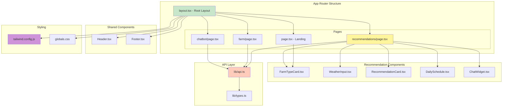

# AgriAdvisor Frontend

**Azərbaycan kənd təsərrüfatı üçün qayda əsaslı məsləhət sisteminin Next.js frontend interfeysi**

[](https://nextjs.org/)
[](https://www.typescriptlang.org/)
[](https://tailwindcss.com/)
[](https://react.dev/)

## 📑 Table of Contents

- [🚀 Quick Start](#-quick-start)
- [🏗️ Architecture Diagrams](#️-architecture-diagrams)
  - [Component Hierarchy](#component-hierarchy)
  - [User Flow - Recommendation Wizard](#user-flow---recommendation-wizard)
  - [Page Structure & Routing](#page-structure--routing)
- [📁 Struktur](#-struktur)
- [🎨 Design System](#-design-system)
  - [Rənglər](#rənglər)
  - [Komponentlər](#komponentlər)
  - [Design System Visual](#design-system-visual)
- [🔗 API Connection](#-api-connection)
  - [Environment Variables](#environment-variables)
  - [Weather Auto-Fetch Feature](#weather-auto-fetch-feature)
- [📱 Səhifələr](#-səhifələr)
- [🛠️ Tech Stack](#️-tech-stack)
- [🚀 Production Deployment](#-production-deployment)

---

## 🚀 Quick Start

```bash
# Install dependencies
npm install

# Run development server
npm run dev

# Build for production
npm run build
npm start
```

Server: http://localhost:3000

---

## 🏗️ Architecture Diagrams

### Component Hierarchy



### User Flow - Recommendation Wizard

```mermaid
stateDiagram-v2
    [*] --> Landing: User visits site

    Landing --> Step1: Click "Tövsiyə Al"

    state Step1 {
        [*] --> SelectFarm: Choose Farm Type
        SelectFarm --> ValidateFarm: Wheat/Livestock/Orchard/Vegetable/Mixed
        ValidateFarm --> [*]: Next
    }

    Step1 --> Step2: Farm selected

    state Step2 {
        [*] --> AutoFetch: Option: Auto-fetch weather
        AutoFetch --> WeatherForm: Manual or auto-filled
        WeatherForm --> EnterWeather: Temperature, Humidity, Rainfall
        EnterWeather --> EnterSoil: Soil Moisture, pH
        EnterSoil --> [*]: Next
    }

    Step2 --> Step3: Weather entered

    state Step3 {
        [*] --> CropDetails: If Crop Farm
        [*] --> LivestockDetails: If Livestock Farm
        [*] --> MixedDetails: If Mixed Farm

        CropDetails --> CropType: Select crop
        CropType --> GrowthStage: Select stage
        GrowthStage --> DaysInput: Days since irrigation/fertilization
        DaysInput --> [*]: Submit

        LivestockDetails --> AnimalType: Select animal
        AnimalType --> HealthStatus: Health metrics
        HealthStatus --> [*]: Submit

        MixedDetails --> Components: Select farm components
        Components --> Resources: Resource availability
        Resources --> [*]: Submit
    }

    Step3 --> Processing: Submit request

    state Processing {
        [*] --> CallAPI: POST /api/v1/recommendations
        CallAPI --> RuleEngine: Backend processes
        RuleEngine --> Response: Recommendations generated
        Response --> [*]
    }

    Processing --> Step4: Results ready

    state Step4 {
        [*] --> DisplayCritical: Critical alerts (red)
        DisplayCritical --> DisplayHigh: High priority (orange)
        DisplayHigh --> DisplayMedium: Medium priority (yellow)
        DisplayMedium --> DisplayLow: Low priority (blue)
        DisplayLow --> ShowSchedule: Daily schedule
        ShowSchedule --> ShowSummary: Summary message
        ShowSummary --> [*]
    }

    Step4 --> ChatOption: User can ask questions

    state ChatOption {
        [*] --> OpenChatbot
        OpenChatbot --> AskQuestion: Azerbaijani question
        AskQuestion --> AIResponse: Gemini AI responds
        AIResponse --> QuickReplies: Quick reply buttons
        QuickReplies --> [*]
    }

    ChatOption --> Step4: Continue viewing
    Step4 --> Step1: Start over

    Step4 --> [*]: Exit
```



### Page Structure & Routing

```mermaid
graph LR
    subgraph "Routes"
        R1[/ - Landing Page]
        R2[/recommendations - Wizard]
        R3[/farm - Farm Profile]
        R4[/chatbot - AI Chat]
    end

    subgraph "Landing Components"
        Hero[Hero Section]
        Features[Features Grid]
        FarmTypes[Farm Type Cards]
        CTA[Call to Action]
    end

    subgraph "Wizard Steps"
        S1[Step 1: Farm Type]
        S2[Step 2: Weather & Soil]
        S3[Step 3: Details]
        S4[Step 4: Results]
    end

    subgraph "Backend API Calls"
        A1[GET /api/v1/farms]
        A2[GET /api/v1/weather/auto]
        A3[POST /api/v1/recommendations]
        A4[POST /api/v1/chat/message]
    end

    R1 --> Hero
    R1 --> Features
    R1 --> FarmTypes
    R1 --> CTA

    R2 --> S1
    S1 --> S2
    S2 --> S3
    S3 --> S4

    S1 --> A1
    S2 --> A2
    S3 --> A3
    R4 --> A4

    style R1 fill:#c8e6c9
    style R2 fill:#fff59d
    style R3 fill:#ce93d8
    style R4 fill:#f8bbd0
    style A3 fill:#ffab91
    style A4 fill:#90caf9
```

---

## 📁 Struktur

```
frontend/
├── app/
│   ├── layout.tsx           # Root layout
│   ├── page.tsx             # Landing page
│   ├── globals.css          # Global styles
│   ├── recommendations/
│   │   └── page.tsx         # Recommendations wizard
│   └── farm/
│       └── page.tsx         # Farm profile
├── components/
│   ├── Header.tsx           # Navigation header
│   ├── Footer.tsx           # Footer
│   ├── FarmTypeCard.tsx     # Farm type selector
│   ├── WeatherInput.tsx     # Weather input form
│   ├── RecommendationCard.tsx # Recommendation display
│   └── DailySchedule.tsx    # Daily schedule view
├── lib/
│   └── api.ts               # API client & types
├── tailwind.config.js       # Tailwind configuration
└── package.json
```

## 🎨 Design System

### Rənglər
- **Leaf** (Yaşıl): Primary, success states
- **Earth** (Torpaq): Neutral, backgrounds
- **Wheat** (Sarı): Accent, medium priority
- **Sky** (Mavi): Info, low priority
- **Danger** (Qırmızı): Critical alerts

### Komponentlər
- `.card` - Basic card
- `.card-hover` - Card with hover effect
- `.btn-primary` - Primary button (green)
- `.btn-secondary` - Secondary button (neutral)
- `.btn-danger` - Danger button (red)
- `.input` - Text input
- `.select` - Select dropdown
- `.badge-*` - Status badges (critical, high, medium, low, info)

### Design System Visual

```mermaid
graph TB
    subgraph "Color Palette"
        subgraph "Leaf - Primary"
            L1[leaf-50: #f0fdf4]
            L2[leaf-100: #dcfce7]
            L3[leaf-600: #16a34a]
            L4[leaf-700: #15803d]
        end

        subgraph "Earth - Neutral"
            E1[earth-50: #fafaf9]
            E2[earth-100: #f5f5f4]
            E3[earth-600: #57534e]
            E4[earth-900: #1c1917]
        end

        subgraph "Wheat - Accent"
            W1[wheat-50: #fefce8]
            W2[wheat-400: #facc15]
            W3[wheat-600: #ca8a04]
        end

        subgraph "Danger - Critical"
            D1[danger-50: #fef2f2]
            D2[danger-400: #f87171]
            D3[danger-600: #dc2626]
        end

        subgraph "Sky - Info"
            S1[sky-50: #f0f9ff]
            S2[sky-400: #38bdf8]
            S3[sky-600: #0284c7]
        end
    end

    subgraph "Component Classes"
        subgraph "Buttons"
            B1[.btn-primary]
            B2[.btn-secondary]
            B3[.btn-danger]
        end

        subgraph "Cards"
            C1[.card]
            C2[.card-hover]
        end

        subgraph "Badges"
            Badge1[.badge-critical]
            Badge2[.badge-high]
            Badge3[.badge-medium]
            Badge4[.badge-low]
            Badge5[.badge-info]
        end

        subgraph "Forms"
            F1[.input]
            F2[.select]
        end
    end

    L3 --> B1
    E3 --> B2
    D3 --> B3

    L1 --> C1
    L2 --> C2

    D2 --> Badge1
    W2 --> Badge2
    W3 --> Badge3
    S2 --> Badge4
    E2 --> Badge5

    L1 --> F1
    L1 --> F2

    style L3 fill:#16a34a,color:#fff
    style E3 fill:#57534e,color:#fff
    style W2 fill:#facc15
    style D2 fill:#f87171
    style S2 fill:#38bdf8
```



## 🔗 API Connection

### Environment Variables

**Required**:
- `NEXT_PUBLIC_API_URL`: Backend API URL
  - Local: `http://localhost:8000`
  - Production: `https://your-backend.onrender.com`

**Setup**:
```bash
# For local development
cp .env.local.example .env.local
# Edit .env.local and set NEXT_PUBLIC_API_URL=http://localhost:8000

# For production (Vercel)
# Set NEXT_PUBLIC_API_URL in Vercel Dashboard → Settings → Environment Variables
```

The Next.js config includes a proxy rewrite to forward `/api/v1/*` requests to the backend.

⚠️ **Important**: All frontend environment variables MUST be prefixed with `NEXT_PUBLIC_` to be accessible in the browser.

### Weather Auto-Fetch Feature

**Architecture**: Backend-First (Security Best Practice)

```
User Browser → Frontend → Backend API → External APIs
                                      ↓
                               (IP Geolocation + Weather Data)
```

**Why Backend-First?**
- ✅ No API endpoints exposed to browser
- ✅ Backend controls rate limiting and caching
- ✅ Better security (no API keys in frontend code)
- ✅ Graceful fallback to manual input if auto-fetch fails

**Usage in Code**:
```typescript
import { autoFetchWeather } from '@/lib/api';

// Call backend endpoint to auto-fetch weather
const result = await autoFetchWeather();
// Backend handles IP detection and weather API calls
```

**User Flow**:
1. User clicks "Avtomatik Al" button in recommendations page
2. Frontend calls `/api/v1/weather/auto` endpoint
3. Backend detects user's location from IP address
4. Backend fetches weather data from Open-Meteo API
5. Backend maps location to Azerbaijan region
6. Frontend receives complete weather data and auto-fills the form
7. If auto-fetch fails, user can manually enter weather data (fallback)

## 📱 Səhifələr

### Ana Səhifə (`/`)
- Hero section
- Features overview
- Farm types
- CTA

### Tövsiyələr (`/recommendations`)
4 addımlı wizard:
1. Ferma tipi seçimi
2. Hava şəraiti
3. Əlavə detallar
4. Nəticələr

### Ferma Profili (`/farm`)
- Ferma məlumatlarını saxlama
- LocalStorage-də saxlanılır

## 🛠️ Tech Stack

- **Framework**: Next.js 14 (App Router)
- **Styling**: Tailwind CSS
- **Icons**: Lucide React
- **Language**: TypeScript
- **Animations**: Framer Motion
- **Markdown**: React Markdown + Remark GFM

---

## 🚀 Production Deployment

### Deploy to Vercel (Recommended)

#### Option 1: Vercel CLI

```bash
# Install Vercel CLI globally
npm i -g vercel

# Navigate to frontend directory
cd frontend

# Deploy to production
vercel --prod
```

#### Option 2: Vercel Dashboard

1. Visit [Vercel](https://vercel.com)
2. Click **"New Project"**
3. Import your GitHub repository
4. Configure:
   - **Framework Preset**: Next.js
   - **Root Directory**: `frontend`
   - **Build Command**: `npm run build`
   - **Output Directory**: `.next`
5. Add Environment Variable:
   - **Key**: `NEXT_PUBLIC_API_URL`
   - **Value**: `https://rule-based-system.onrender.com` (or your backend URL)
6. Click **Deploy**

#### Post-Deployment

After deploying, update the backend CORS settings:

1. Go to your Render backend dashboard
2. Navigate to **Environment Variables**
3. Update `CORS_ORIGINS` to include your Vercel URL:
   ```
   CORS_ORIGINS=https://your-app.vercel.app
   ```
4. Backend will automatically redeploy

### Deploy to Other Platforms

#### Netlify

```bash
# Install Netlify CLI
npm i -g netlify-cli

# Navigate to frontend
cd frontend

# Build
npm run build

# Deploy
netlify deploy --prod --dir=.next
```

#### Self-Hosted (Docker)

```bash
# Build Docker image
docker build -t yonca-frontend .

# Run container
docker run -p 3000:3000 \
  -e NEXT_PUBLIC_API_URL=https://your-backend-url.com \
  yonca-frontend
```

### Environment Variables for Production

| Variable | Required | Example | Description |
|----------|----------|---------|-------------|
| `NEXT_PUBLIC_API_URL` | ✅ Yes | `https://rule-based-system.onrender.com` | Backend API base URL |

⚠️ **Important**: All Next.js environment variables that need to be accessible in the browser MUST be prefixed with `NEXT_PUBLIC_`.

---

## 📚 Additional Resources

- [Main README](../README.md) - Full project documentation
- [Backend README](../backend/README.md) - Backend API documentation
- [Next.js Documentation](https://nextjs.org/docs)
- [TailwindCSS Documentation](https://tailwindcss.com/docs)
- [Vercel Deployment Guide](https://vercel.com/docs)

---

